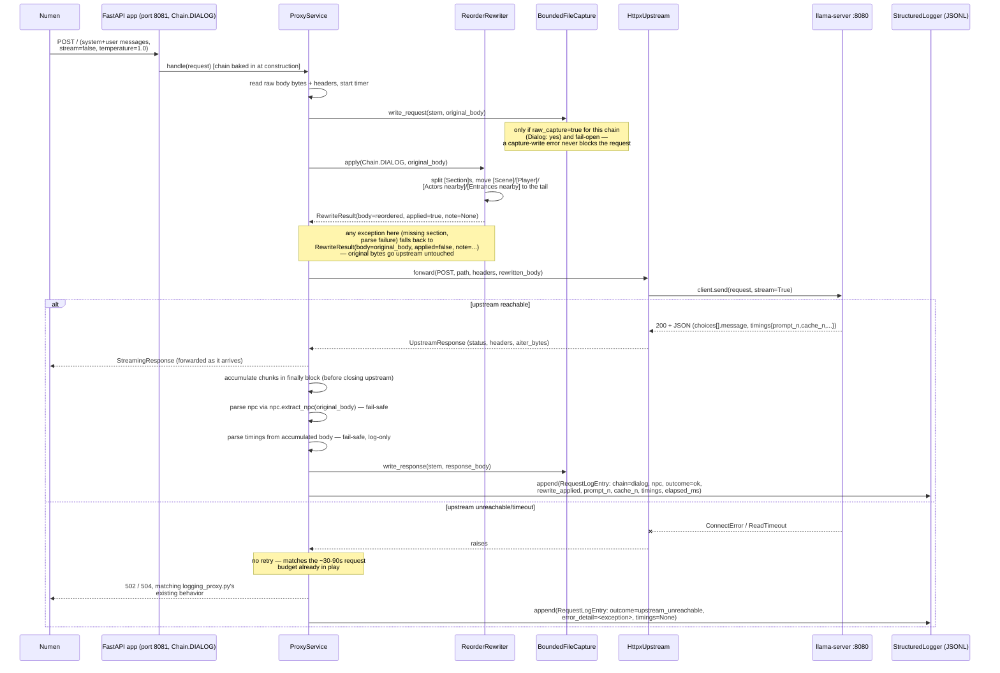
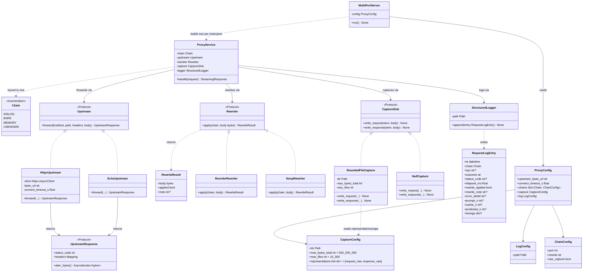

# numen_proxy architecture

This documents the design of `src/numen_proxy/` — the hardened,
multi-port proxy between Numen and llama-server (see the repo root
`CLAUDE.md` for what the project is and why). It covers what's referred to as
"Phase 1" in `docs/plan.md`: making the proxy safe to leave running for a
full play session, with per-chain routing, bounded capture, and structured
logging. It does not cover Phase 3+ (the archive, offline distillation,
retrieval) except where noted as a forward-compatibility check.

## Design patterns

- **Protocol-based DI.** `Upstream`, `Rewriter`, `CaptureSink`, and
  `UpstreamResponse` are all `typing.Protocol`s — structural typing, no base
  class required. `ProxyService` takes its collaborators as constructor
  arguments and never imports FastAPI, so it's testable with zero HTTP
  machinery.
- **Strategy pattern** for anything that varies by chain. `Rewriter` has
  `ReorderRewriter` (Dialog/Bark) and `NoopRewriter` (Memory — an *explicit*
  no-op, not an incidental skip). `CaptureSink` has `BoundedFileCapture` and
  `NullCapture` the same way.
- **Adapter.** `UpstreamResponse` (`status_code`, `headers`, `aiter_bytes()`)
  decouples `ProxyService` from httpx's concrete response type, so test
  doubles don't need to fabricate a real `httpx.Response`.
- **Composition root / factory.** `app.py`'s `create_app(chain, service)`
  builds one FastAPI app per chain; `server.py`'s `MultiPortServer` builds N
  of them from config and runs them concurrently; `__main__.py` wires
  everything to real implementations. Each package builds its own concrete
  strategies (`rewrite/__init__.py`'s `build_rewriter`,
  `capture/__init__.py`'s `build_capture_sink`) rather than a central place
  importing every concrete class — `config.py` stays pure schema and never
  imports `BoundedFileCapture`, `ReorderRewriter`, etc.
- **Fail-open wrapper.** Rewrite and both capture writes share one shape: try
  the risky thing, on any exception log a warning and fall back to the safe
  default. One reusable helper, not three copies of try/except — this is
  what makes "fail-safe by default" structural rather than a convention to
  remember.
- **The load-bearing invariant:** `ProxyService` must never contain
  `if self.chain == Chain.MEMORY: ...`, or any per-chain branch. Every
  per-chain difference is resolved exactly once, at startup, by a factory
  choosing which concrete strategy instance that chain's `ProxyService`
  holds. A per-chain `if` appearing in request-handling code is a sign this
  pattern is being violated — the fix is a new Strategy implementation, not
  a branch.

## Package layout

```
src/numen_proxy/
  __main__.py            load config -> build MultiPortServer -> run
  config.py               ProxyConfig / ChainConfig / CaptureConfig / LogConfig
                           (pydantic) + load_config(path) via stdlib tomllib
                           — schema only, never imports concrete strategies
  chains.py                Chain(StrEnum): DIALOG, BARK, MEMORY, UNKNOWN
  npc.py                    extract_npc(body: bytes) -> str | None
                            (regex over [Your character], fail-safe: None on miss)
  upstream.py               Upstream Protocol, byte-level:
                              forward(method, path, headers, body) -> UpstreamResponse
                            HttpxUpstream (real) + EchoUpstream (test double)
  rewrite/
    __init__.py              build_rewriter(name: str) -> Rewriter — factory,
                              the one place "reorder"/"noop" resolve to a class
    protocol.py              Rewriter: apply(chain, body: bytes) -> RewriteResult
    reorder.py                ReorderRewriter — absorbs tools/rewrite.py's logic
    noop.py                    NoopRewriter
  capture/
    __init__.py              build_capture_sink(chain_config, capture_config)
                              -> CaptureSink — factory, resolves raw_capture
    protocol.py              CaptureSink: write_request(...), write_response(...)
    file_capture.py           BoundedFileCapture — rotating, size-capped
    null_capture.py            NullCapture
  logging_/
    schema.py                RequestLogEntry (pydantic) — the JSONL row shape
    jsonl_logger.py           StructuredLogger — append-only, one shared instance
  proxy.py                  ProxyService — orchestrates rewrite -> forward ->
                            capture -> log -> response; owns the fail-open policy;
                            no FastAPI import, framework-agnostic
  app.py                    create_app(chain, service) -> FastAPI; one catch-all
                            route per app, chain is baked in by construction
  server.py                 MultiPortServer — one uvicorn.Server per configured
                            chain/port, run together via asyncio.gather
```

`logging_` (trailing underscore) avoids shadowing the stdlib `logging`
module.

`models.py`'s existing `ChatRequest`/`ChatResponse`/`Message` stay as the
`EchoUpstream` demo's data shape and are **not** the real proxy's data path.
Forcing a real Numen payload through a narrow pydantic schema and
re-serializing it would silently drop any field that schema doesn't know
about — and Numen's body has 20+ top-level `[Section]`s plus sampling
params. That breaks the lossless/structure-preserving guarantee required of
every rewrite. So `ProxyService` and `HttpxUpstream` work on raw `bytes` end
to end; only `rewrite/reorder.py` touches content, and it operates on
section text via regex, not a typed model — same approach as today's
`tools/rewrite.py`.

`tools/rewrite.py`, `tools/replay.py`, and `tools/logging_proxy.py` retire
once `reorder.py`/`capture/`/`logging_/` reach parity with them (per
`docs/plan.md` D10) — `rewrite.py`'s logic moves in via a tracked
rename, not a copy. `tools/echo_upstream.py` is referenced by CLAUDE.md and
`docs/plan.md` as an existing standalone replay script; it doesn't exist
yet (only the `EchoUpstream` class does) and should be created as a thin
script wrapping `create_app(Chain.DIALOG, ...)` with `EchoUpstream`.

## Data model

**`Chain`** — `StrEnum`: `DIALOG`, `BARK`, `MEMORY`, `UNKNOWN`. `UNKNOWN`
covers an unconfigured port or the never-captured N2N chain — still
forwarded and logged rather than crashing, so an unrecognized chain is
visible instead of silently mishandled.

**Chain classification is structural, not inferred.** Each configured chain
gets its own listening port; `MultiPortServer` builds one `ProxyService` per
port, each permanently bound to one `Chain` at construction. Nothing parses
the request body to guess what kind of request it is. The alternative — body
heuristics, e.g. "no `system` message means Memory chain" — works today but
describes an incidental fact about the current Numen version, not a
contract; if it ever changed, the heuristic wouldn't error, it would just
silently misclassify (e.g. running `ReorderRewriter` against a Memory-chain
request, which must never be modified). This does depend on Numen's
`Agent.ini` actually allowing each agent config to point at a distinct
URL/port — unconfirmed as of this writing, since the real `Agent.ini` isn't
readable through MO2's virtual filesystem. Worth verifying before
`MultiPortServer` is built; if it turns out false, chain classification
falls back to body heuristics.

**Config** — TOML, loaded via stdlib `tomllib` (Python 3.12+, no new
dependency):

```toml
[upstream]
base_url = "http://127.0.0.1:8080"
connect_timeout_s = 5.0
# deliberately no read timeout — matches iChainTimeoutSeconds=90

[chains.dialog]
port = 8081
rewrite = "reorder"
raw_capture = true

[chains.bark]
port = 8082
rewrite = "reorder"
raw_capture = true

[chains.memory]
port = 8083
rewrite = "noop"
raw_capture = false   # see Capture & persistence

[capture]
dir = "tools/captures"
max_bytes_total = 500_000_000
max_files = 15000
representations = ["request_raw", "response_raw"]
# add "prompt_txt" and/or "rewritten_json" for logging_proxy.py's full
# four-file-per-request debug output — off by default

[log]
path = "tools/logs/requests.jsonl"
```

Config loading: pydantic models define schema and defaults, `tomllib` parses
the file into a dict, `ProxyConfig.model_validate(raw)` validates it.

```python
def load_config(path: Path) -> ProxyConfig:
    with path.open("rb") as f:
        raw = tomllib.load(f)
    return ProxyConfig.model_validate(raw)
```

- Defaults live on the model, not the file — a TOML file only overrides what
  differs; an empty or missing `[capture]` table is valid.
- Validation happens once, at startup, and **fails loud** — a bad value
  raises `pydantic.ValidationError` naming the exact field before
  `MultiPortServer` binds a port. This is deliberately not fail-open: a bad
  config should stop the proxy before Numen ever sends it a request.
- Nested TOML tables become nested models automatically — no manual dict
  indexing anywhere in the codebase.
- No env-var layer — `pydantic-settings` would add that, but nothing in
  Phase 1 needs it (one machine, one config file).

```python
class CaptureConfig(BaseModel):
    dir: Path = Path("tools/captures")
    max_bytes_total: int = 500_000_000
    max_files: int = 15_000
    representations: list[
        Literal["request_raw", "response_raw", "prompt_txt", "rewritten_json"]
    ] = ["request_raw", "response_raw"]

class RequestLogEntry(BaseModel):
    ts: datetime
    chain: Chain
    npc: str | None
    outcome: Literal["ok", "upstream_unreachable", "upstream_timeout", "rewrite_failed"]
    status_code: int | None
    elapsed_ms: float
    rewrite_applied: bool
    rewrite_note: str | None
    error_detail: str | None        # exact exception type/message on failure
    prompt_n: int | None
    cache_n: int | None
    predicted_n: int | None
    timings: dict[str, Any] | None  # raw passthrough — not our schema to pin down
```

## Capture & persistence

Two separate artifacts — don't conflate them:

1. **Raw bounded capture** (`capture/file_capture.py`) — request/response
   bytes, size-capped and rotating (oldest evicted past `max_bytes_total`/
   `max_files`), trimmed by default to `request.raw`/`response.raw`
   (~33KB/request) rather than the four files `logging_proxy.py` writes
   today (~127KB/request, measured against the existing capture directory —
   `request.raw` + `request.json` + `request.rewritten.json` + `prompt.txt`
   per request). **Dialog and Bark only.** Memory-chain raw capture is
   deliberately out of scope here: Phase 3's Archive captures the Memory
   chain both directions specifically so it can content-hash and dedupe at
   the event level, and it's a wholly separate component (watches Numen's
   on-disk memory files directly, writes to SQLite) — it doesn't reuse
   `CaptureSink` at all, so there's nothing to parameterize per-chain here
   for that purpose.
2. **Structured JSONL log** (`logging_/jsonl_logger.py`) — one small
   metadata row per request, **all chains including Memory**, since it's
   `prompt_n`/`cache_n`/`timings`/`outcome`, not a body copy. Always on, no
   per-chain toggle — `LogConfig` only configures *where* it writes, not
   *whether*. This is the dataset the Phase 2 cache-hit regression guard and
   the `lossy=200` measurement (`docs/plan.md` 0.4) both read from.

Neither is SQLite in Phase 1 — that's specifically Phase 3's storage model
(append-only, WAL mode, keyed by content hash). Phase 1 is deliberately
flat-file: JSONL is `grep`/`jq`-able, which is all Phase 1's own consumers
need.

One redundancy this doesn't solve: Dialog/Bark raw captures stay highly
repetitive turn-to-turn (`[Recent Events]`, `[Glossary]` etc. resend close
to unchanged). Phase 1 controls this with bounds + rotation, not
content-hash dedup — that's a Phase 3 archive technique, not pulled forward
here.

**Where the choice gets made** — two decisions, two different times:

- *Which chains get raw capture at all* — decided once, at startup, by
  `build_capture_sink(chain_config, capture_config) -> CaptureSink` in
  `capture/__init__.py`, reading `ChainConfig.raw_capture`. Called once per
  chain by `MultiPortServer` while building that chain's `ProxyService`.
- *Which files get written per request* — decided at runtime, inside the
  `BoundedFileCapture` instance itself, checking membership in the
  `representations` set it was constructed with.
- `representations` is global under `[capture]`, not per-chain — Dialog and
  Bark share the same "which files" answer; only the on/off switch varies
  per chain.

## Upstream failure policy

No retries — requests can legitimately run 30–90s already
(`iChainTimeoutSeconds=90`), so retrying risks compounding into the watchdog
window. Any successful upstream response, whatever its status, is forwarded
byte-for-byte (the existing fail-open passthrough guarantee).

For no response at all:

- `httpx.ConnectError` → `502`
- `httpx.ConnectTimeout` / `ReadTimeout` / `PoolTimeout` → `504`
- both logged to the JSONL log with `outcome` set accordingly and
  `error_detail` carrying the exact exception type and message.

This matches `logging_proxy.py`'s existing behavior (it already returns
`502` today) rather than fabricating a synthetic response Numen has never
seen — Numen's own error handling for "couldn't connect"/"timed out" is
known-good; a fabricated 200 would be the untested, riskier path.

**Open tension:** this means the proxy can return a 5xx, which conflicts
with CLAUDE.md's literal "The proxy must never return 5xx." Worth either
narrowing that constraint's wording to proxy-internal failures (parse/
rewrite/capture bugs) rather than upstream reachability, or empirically
checking in-game whether a `502`/`504` from the proxy actually triggers
`iAgentCooldownSeconds=30` versus Numen tolerating it the same way it
tolerates a direct connection failure. Not resolved as of this writing.

## Streaming

Numen sends `stream: false` today, but the SSE path should be tested, not
assumed. `HttpxUpstream.forward` uses `client.send(req, stream=True)`, and
`ProxyService` wraps `response.aiter_bytes()` in a `StreamingResponse`,
accumulating chunks for capture/logging in a `finally` block *before* the
upstream connection closes — carried over from `logging_proxy.py`'s
existing pattern, which has an explicit comment about why the accumulation
must happen before any `await` that cancellation could interrupt.

## Request flow: a Dialog turn end-to-end

Bark is identical, just a different port/`Chain`/log tag — same
`ReorderRewriter`, same capture wiring (`dialog-prompt.md` covers both
chains).



- **Chain identity is never inspected at request time** — the `ProxyService`
  handling this request already knows it's `Chain.DIALOG` from construction.
- **Capture happens twice, independently** — the original body goes to
  `write_request` before rewrite runs; the response goes to `write_response`
  after the upstream call completes. The rewritten body isn't captured by
  default; whether a rewrite fired is recorded in the JSONL row instead.
- **Two fail-open points, one hard-failure point.** Rewrite and both capture
  writes degrade to "skip, log a warning, keep going." The upstream call is
  the one place that can't be fail-open in that sense — if llama-server is
  genuinely unreachable there's no original response to fall back to, which
  is what the Upstream failure policy addresses directly.
- **The response streams to Numen before logging finishes** — accumulate/
  parse/log aren't on the critical path to what Numen sees; a slow disk
  write can't add latency to the response.

## Class diagram



Each `ProxyService` is bound to exactly one `Chain` at construction — this is
what makes chain classification structural rather than a runtime body/header
check. `MultiPortServer` reads `ProxyConfig`, and for every `[chains.*]`
entry builds one `ProxyService` (wired to the right `Rewriter`/`CaptureSink`
strategy per that chain's config) plus one FastAPI app bound to its own
port, then runs all of them concurrently in one process via
`asyncio.gather`.

## Extending per-chain behavior

**Rewrite is already per-chain.** `ChainConfig.rewrite` picks each chain's
`Rewriter` independently. A new per-chain rewrite behavior is: implement
`Rewriter`, register it by name in `rewrite/__init__.py`'s `build_rewriter`
factory, point that chain's config at the new name. No other chain, and
nothing in `ProxyService`/`MultiPortServer`, changes.

**Capture/log destination is deliberately not per-chain.**
`RequestLogEntry.chain` is on every JSONL row, so slicing the shared log by
chain is a filter, not something requiring separate files. And the case that
might motivate per-chain destinations — Phase 3 wanting to treat Memory
fundamentally differently — doesn't route through `CaptureConfig`/
`LogConfig` at all, since Phase 3's Archive is a separate component that
doesn't reuse `CaptureSink`/`StructuredLogger` regardless of how
configurable they are.

**Technical ease isn't the same as a green light.** Modifying the Memory
chain's own prompt (e.g. injecting custom instructions) is trivial by the
recipe above — new `Rewriter`, one config line — but D3 (`docs/plan.md`)
exists because the failure mode is Numen's actual persistent memory getting
corrupted. That reasoning doesn't weaken just because the code to do it is
one config line away.

## Forward compatibility: Phase 5 retrieval

Not built in Phase 1, but the architecture was checked against it, since
`docs/idea.md` proposes inserting a new `[Old Memories]` section "in the
stable zone near the volatile tail," and Phase 5's D9 (re-select on
conversation start/location/topic-change, never mid-conversation) implies
requirements beyond what a Phase 1 `Rewriter` does.

**Reuses cleanly:**

- The `Rewriter` Protocol itself — a `RetrievalAugmentRewriter` is just
  another implementation.
- The composition root — a retrieval index client is one more dependency
  constructed in `__main__.py`/`server.py` and injected, same as
  `HttpxUpstream` gets its `httpx.AsyncClient`.
- Fail-open — a down retrieval index degrades to "skip, forward as-is,"
  which gives D2 ("augment, not substitute") for free.
- The per-chain `rewrite` config string — `"reorder"` becomes
  `"retrieval+reorder"`, a new named strategy via `build_rewriter`.
- `reorder.py`'s section-splitting (`split_sections`/`SECTION_RE`) — reused
  for finding the insertion point, **not** via a generic bytes-level
  pipeline of independent `Rewriter`s. Insertion needs the same
  volatile-boundary computation `ReorderRewriter` already does; two
  black-box `Rewriter`s each parsing raw bytes independently risks two
  drifting implementations of "where's the tail" that no per-stage test
  would catch. Right shape: parse once, run both the insert and reorder
  transform against the same in-memory section list, serialize once —
  composition one level below the `Rewriter` Protocol boundary.

**Genuine gaps, not just reuse:**

- **Conversation-scoped state.** Every Phase 1 `Rewriter` is a pure function
  of one request's body — nothing tracks "same conversation as last turn."
  D9 needs a new `ConversationTracker` component persisting between
  requests for the same NPC.
- **Idempotency means something different for insertion than reordering.**
  The existing rewrite invariants (lossless — identical line multiset;
  idempotent — byte-identical on re-application) were written for
  reordering, where nothing is added. Augmentation adds content by design;
  Phase 5 needs its own version of that invariant ("re-applying replaces the
  old selection, not byte-identical output"), not an inherited one.
- `RewriteResult` would likely grow one optional field
  (`selected_memory_ids: list[str] | None`) for the log — additive, doesn't
  touch existing rewriters.

Net: Phase 5 is a new `Rewriter` plus one new stateful collaborator, not a
redesign.

## Known open items

- Whether Numen's real `Agent.ini` supports distinct URLs per agent — the
  assumption the whole multi-port design rests on. Unverified; the file
  isn't readable through MO2's virtual filesystem yet.
- The 5xx-on-unreachable-upstream conflict with CLAUDE.md's literal wording
  — either narrow the constraint's wording or verify in-game whether a
  502/504 from the proxy triggers `iAgentCooldownSeconds=30`.
- The golden corpus (`tests/golden_corpus/`, scrubbed real captures)
  doesn't exist yet, despite CLAUDE.md treating it as the core test asset —
  needs to be built as part of Phase 1, not assumed already present.
- `tools/echo_upstream.py` needs creating as a real script — currently only
  referenced in docs, not present in the repo.
